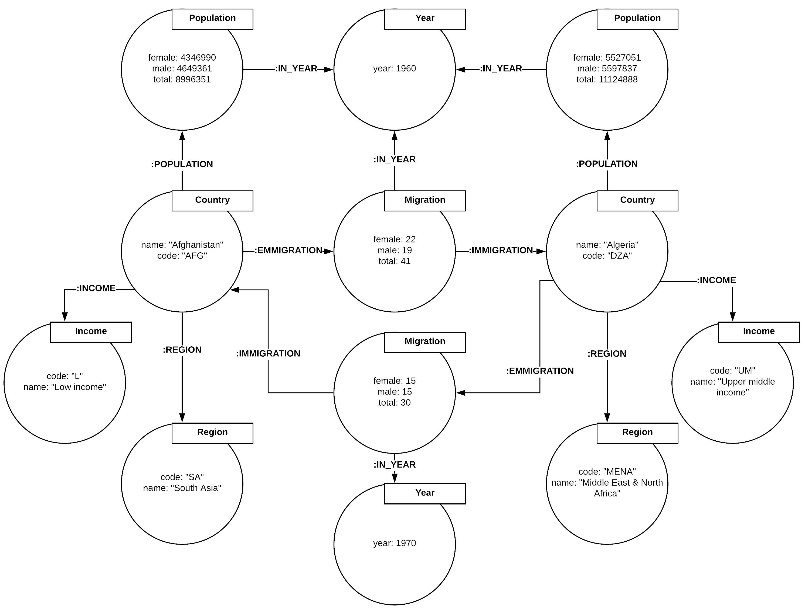

```{r setup, include=FALSE}
knitr::opts_chunk$set(echo = TRUE)

# Load required packages and install them if necessary
if (!"flexdashboard" %in% rownames(installed.packages())) {
  install.packages("flexdashboard")
}
library(flexdashboard)

if (!"shiny" %in% rownames(installed.packages())) {
  install.packages("shiny")
}
library(shiny)

if (!"visNetwork" %in% rownames(installed.packages())) {
  install.packages("visNetwork")
}
library(visNetwork)

if (!"ggplot2" %in% rownames(installed.packages())) {
  install.packages("ggplot2")
}
library(ggplot2)

if (!"tidyverse" %in% rownames(installed.packages())) {
  install.packages("tidyverse")
}
library(tidyverse)

if (!"neo4r" %in% rownames(installed.packages())) {
  install.packages("neo4r")
}
library(neo4r)
```

# Setup
An installation of Neo4j is required to create this report.

Click the link below and follow the instructions to install Neo4j on your machine.
https://neo4j.com/docs/operations-manual/current/installation/
You should now be able to run Neo4j from the command line.

Now, download Neo4j Desktop from this address: https://neo4j.com/download/
It will consist of only one file.
Execute the file and Neo4j Desktop will open.

Create an account, log in, and create a project.
Select the project and click "Add Graph". Name the graph.

Click "Manage" and go to the Settings tab.
Scroll to the line of code "dbms.directories.import=import", it should be the first uncommented line.
Comment it out by typing a "#" in front of it.
Scroll to the line of code "dbms.security.auth_enabled=true", it should be the next uncommented line.
Change it to "false" and click "Apply".

Now click "Start" (the play button) on the graph and select "Continue Anyway".
Go to the Details tab and write down the HTTP port being used.

In this document, go to the first code chunk in the section labeled "Populating the Database" and ensure that the port number is correct (i.e. the number after "http://localhost:").

Once the database is populated via the code in this document, you can open Neo4j Browser from the Desktop to directly visualise the data model and perform Cypher queries.

# Project Motivation
This project is designed as an exercise in using the property graph data model for highly connected data and analysing flow over a network. We use the [Neo4j](https://neo4j.com/developer/r/) graph database to store and query bilateral migration and population data for over 200 countries.

# About the Data
## Source:
This project uses all available data from the World Bank [Global Bilateral Migration Database](https://databank.worldbank.org/data/reports.aspx?source=global-bilateral-migration), contaning the origin, destination, and gender of migrants for 232 countries in 1960, 1970, 1980, 1990, and 2000 with raw counts of annual migrant flow. This is joined with World Bank's [World Development Indicator](https://databank.worldbank.org/data/reports.aspx?source=2&series=SP.POP.TOTL&country=#) country-level population data for those years. Each country is also associated with a region and a categorical income level in metadata supplied by World Bank.

## Data Model:
The property graph data model requires different thinking than the relational model. In the literal sense, relationships are more central to the graph model than the relational. Neo4j's native graph storage directly encodes relationships between entities, as opposed to the relational model's use of keys for joining tables. Neo4j's native graph processing uses pointer chasing to match patterns of nodes and edges in relation some set of anchored nodes, which is much faster than searching on data contained in node and edge properties. Accordingly, facts are represented as nodes to optimise query performance. The chart below shows an example of our data model:
```{r, out.width="500px", echo=FALSE}

```

### Data, metadata, and descriptions from World Bank are found in the ./data folder. Processed data used in the database are in the ./data/final folder.

# Processing Data and Populating the Database
After following the setup instructions above, connect to the database:
```{r}
con <- neo4j_api$new(
  url = "http://localhost:7474",
  user = "neo4j", 
  password = "neo4j"
)
```

Clear the database if there's anything in it:
```{r}
call_neo4j("MATCH (n) DETACH DELETE n", con)
```

## Pre-Processing
Read the data and rename columns:
```{r}
BilateralMigration <- select(read.csv("./data/Bilateral_Migration.csv", na.strings=c("","NA")),-4)
Population <- read.csv("./data/Population.csv", na.strings=c("","NA"))
IncomeRegion <- select(read.csv("./data/Country_Metadata.csv", na.strings=c("","NA")), 1, 3, 4)

colnames(BilateralMigration) <- c("Origin_Name","Origin_Code","Migration_by_Gender","Dest_Name","Dest_Code","y1960","y1970","y1980","y1990","y2000")
colnames(Population) <- c("Series_Name","Series_Code","Country_Name","Country_Code","y1960","y1970","y1980","y1990","y2000")
colnames(IncomeRegion) <- c("Country_Code","Income_Name","Region_Name")
```

### Processing the Migration Data
If you run the commented line of code for each of the years, you will see that rows with missing values have no data. Therefore we select only rows with complete cases:
```{r}
#BilateralMigration[!complete.cases(BilateralMigration),] %>% summarise(non_na = sum(!is.na(y2000)))

# select complete cases
BilateralMigration <- BilateralMigration[complete.cases(BilateralMigration),]

# gather the years and spread the genders
BilateralMigration <- gather(BilateralMigration, key="Year", value="Mig", y1960, y1970, y1980, y1990, y2000)
BilateralMigration$Year <- BilateralMigration$Year %>% str_sub(2, 5)
BilateralMigration <- spread(BilateralMigration, Migration_by_Gender, Mig)
```

### Processing the Population Data
Of the rows with missing values in Population, 6 have data for year 1990, and 7 have data for year 2000. Therefore we will not filter for only complete cases. Run the commented line below for each year to verify:
```{r}
#Population[!complete.cases(Population),] %>% summarise(non_na = sum(!is.na(y2000)))
```

Replace "Series_Name" and "Series_Code" in Population with a single field:
```{r}
Population <- Population %>%
  mutate(Population_by_Gender = Series_Code %>%
           str_replace("SP\\.POP\\.TOTL\\.MA\\.IN", "Male") %>%
           str_replace("SP\\.POP\\.TOTL\\.FE\\.IN", "Female") %>%
           str_replace("SP\\.POP\\.TOTL", "Total")) %>%
  select(Country_Name, Country_Code, Population_by_Gender, y1960, y1970, y1980, y1990, y2000)
```

Gather the years and spread the genders:
```{r}
# gather
Population <- gather(Population, key="Year", value="Pop", y1960, y1970, y1980, y1990, y2000)

# remove prefixes
Population$Year <- Population$Year %>% str_sub(2, 5)

# we can take complete cases now that years are gathered
Population <- Population[complete.cases(Population),]

# spread
Population <- spread(Population,Population_by_Gender,Pop)
```

Filter Population to only contain data on countries found in BilateralMigration. It is ok if there is migration but not population data for some countries. Since all countries in BilateralMigration are both origins and destinations (run commented line to verify), we only need use one:
```{r}
#setdiff(BilateralMigration$Dest_Code, BilateralMigration$Origin_Code)

Population <- Population %>% filter(Country_Code %in% BilateralMigration$Origin_Code)
```

### Processing Income and Region Data
IncomeRegion contains rows with missing data. All of these are for aggregates and demographic groups, so we'll take only complete cases:
```{r}
IncomeRegion <- IncomeRegion[complete.cases(IncomeRegion),]
```

Create codes for income and region data:
```{r}
IncomeRegion$Income_Code <- IncomeRegion$Income_Name %>% 
  str_replace("High income", "H") %>%
  str_replace("Low income", "L") %>%
  str_replace("Lower middle income", "LM") %>%
  str_replace("Upper middle income", "UM")
IncomeRegion$Region_Code <- IncomeRegion$Region_Name %>%
  str_replace("East Asia & Pacific", "EAP") %>%
  str_replace("Europe & Central Asia", "ECA") %>%
  str_replace("Latin America & Caribbean", "LAC") %>%
  str_replace("Middle East & North Africa", "MENA") %>%
  str_replace("North America", "NA") %>% 
  str_replace("South Asia", "SA") %>%
  str_replace("Sub-Saharan Africa", "SAA")
```

If you run the two commented lines below, you'll see that the same 8 rows in IncomeRegion do not appear in Population or BilateralMigration. Remove those rows:
```{r}
#setdiff(IncomeRegion$Country_Code, BilateralMigration$Origin_Code)
#setdiff(IncomeRegion$Country_Code, Population$Country_Code)

IncomeRegion <- IncomeRegion %>% filter(Country_Code %in% Population$Country_Code)
```

## Save Modified Data to CSV
```{r}
write.csv(BilateralMigration, file="./data/final/Bilateral_Migration_Final.csv", row.names=F)
write.csv(BilateralMigration %>% distinct(Origin_Name, Origin_Code), file="./data/final/Country_Final.csv", row.names=F)
write.csv(Population, file="./data/final/Population_Final.csv", row.names=F)
write.csv(IncomeRegion, file="./data/final/Income_Region_Final.csv", row.names=F)
```

## Populating Neo4j
Constraints:
```{r}
"CREATE CONSTRAINT ON (c:Country) ASSERT exists(c.name);
CREATE CONSTRAINT ON (c:Country) ASSERT exists(c.code);
CREATE CONSTRAINT ON (c:Country) ASSERT c.name IS UNIQUE;
CREATE CONSTRAINT ON (c:Country) ASSERT c.code IS UNIQUE;

CREATE CONSTRAINT ON (m:Migration) ASSERT exists(m.total);
CREATE CONSTRAINT ON (m:Migration) ASSERT exists(m.male);
CREATE CONSTRAINT ON (m:Migration) ASSERT exists(m.female);

CREATE CONSTRAINT ON (y:Year) ASSERT exists(y.year);
CREATE CONSTRAINT ON (y:Year) ASSERT y.year IS UNIQUE;

CREATE CONSTRAINT ON (i:Income) ASSERT exists(i.code);
CREATE CONSTRAINT ON (i:Income) ASSERT exists(i.name);
CREATE CONSTRAINT ON (i:Income) ASSERT i.code IS UNIQUE;
CREATE CONSTRAINT ON (i:Income) ASSERT i.name IS UNIQUE;

CREATE CONSTRAINT ON (r:Region) ASSERT exists(r.code);
CREATE CONSTRAINT ON (r:Region) ASSERT exists(r.name);
CREATE CONSTRAINT ON (r:Region) ASSERT r.code IS UNIQUE;
CREATE CONSTRAINT ON (r:Region) ASSERT r.name IS UNIQUE;" %>%
  call_neo4j(con)
```

Years:
```{r}
"CREATE (:Year {year: 1960}), (:Year {year: 1970}), (:Year {year: 1980}), (:Year {year: 1990}), (:Year {year: 2000});" %>%
  call_neo4j(con)
```

Countries:
```{r}
on_load_country <- 'CREATE (:Country {code: csvLine.Origin_Code, name: csvLine.Origin_Name})'

country_path <- str_c("file://", getwd(), "/data/final/Country_Final.csv")

load_csv(url=country_path, con=con, on_load=on_load_country, as="csvLine", periodic_commit=500)
```

Migrations:
```{r}
on_load_mig <- 
'MATCH (o:Country {code: csvLine.Origin_Code})
MATCH (d:Country {code: csvLine.Dest_Code})
MATCH (y:Year {year: toInteger(csvLine.Year)})
CREATE (m:Migration {female: toInteger(csvLine.Female), male: toInteger(csvLine.Male), total: toInteger(csvLine.Total)})
MERGE (o)-[:EMMIGRATION]->(m)-[:IMMIGRATION]->(d)
MERGE (m)-[:IN_YEAR]->(y);'

mig_path <- str_c("file://", getwd(), "/data/final/Bilateral_Migration_Final.csv")

load_csv(url=mig_path, con=con, on_load=on_load_mig, as="csvLine", periodic_commit=500)
```

Populations:
```{r}
on_load_pop <-
'MATCH (c:Country {code: csvLine.Country_Code})
MATCH (y:Year {year: toInteger(csvLine.Year)})
MERGE (p:Population {total: toInteger(csvLine.Total)})
FOREACH(ignoreMe IN CASE WHEN trim(csvLine.Female) <> "" THEN [1] ELSE [] END | SET p.female = toInteger(csvLine.Female))
FOREACH(ignoreMe IN CASE WHEN trim(csvLine.Male) <> "" THEN [1] ELSE [] END | SET p.male = toInteger(csvLine.Male))
MERGE (c)-[:POPULATION]->(p)-[:IN_YEAR]->(y);'

pop_path <- str_c("file://", getwd(),"/data/final/Population_Final.csv")

load_csv(url=pop_path, con=con, on_load=on_load_pop, as="csvLine", periodic_commit=500)
```

Incomes and Regions:
```{r}
on_load_ir <-
'MATCH (c:Country {code: csvLine.Country_Code})
MERGE (i:Income {code: csvLine.Income_Code, name: csvLine.Income_Name})
MERGE (r:Region {code: csvLine.Region_Code, name: csvLine.Region_Name})
MERGE (c)-[:INCOME]->(i)
MERGE (c)-[:REGION]->(r);'

ir_path <- str_c("file://", getwd(), "/data/final/Income_Region_Final.csv")

load_csv(url=ir_path, con=con, on_load=on_load_ir, as="csvLine", periodic_commit=500)
```

Now that the database is populated, let's free up some RAM:
```{r}
rm(BilateralMigration, IncomeRegion, Population)
```

# Summary Statistics
```{r}
emigrants <- call_neo4j('MATCH (i:Income)<-[:INCOME]-(c:Country)-[:EMMIGRATION]->(m:Migration) RETURN i.name AS Income, sum(m.total) AS Total_Emigrants', con) %>%
  data.frame()
colnames(emigrants) <- c("Income Level", "Total Emigrants")
immigrants <- call_neo4j('MATCH (i:Income)<-[:INCOME]-(c:Country)<-[:IMMIGRATION]-(m:Migration) RETURN i.name AS Income, sum(m.total) AS Total_Emigrants', con) %>%
  data.frame()
colnames(immigrants) <- c("Income Level", "Total Immigrants")
ggplot(emigrants, aes(x = `Income Level`, y = `Total Emigrants`, fill = `Income Level`)) +
  geom_bar(stat = "identity")
ggplot(immigrants, aes(x = `Income Level`, y = `Total Immigrants`, fill = `Income Level`)) +
  geom_bar(stat = "identity")
```


